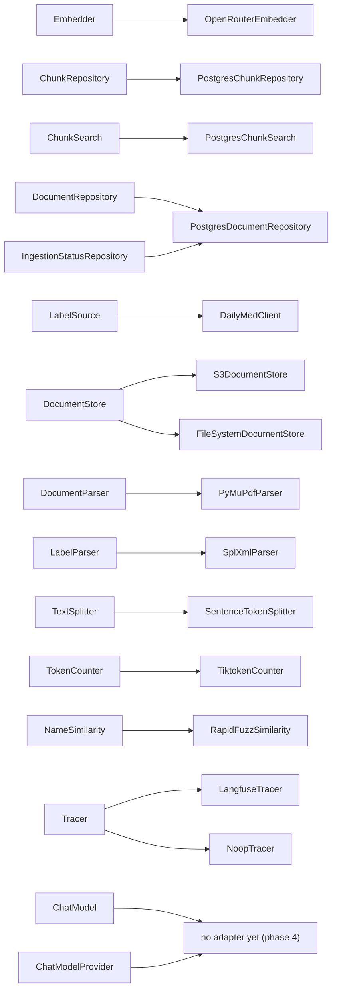

# Backend layers

Dependencies point inward to `app/domain`. `app/wiring.py` and `app/main.py` connect the adapters to the ports. Dotted arrows show "implements".

```mermaid
flowchart TB
    subgraph entry["Entry points"]
        main["main.py<br/>FastAPI app, lifespan"]
        cmds["corpus_download.py<br/>ingest.py<br/>search_cli.py"]
    end

    wiring["wiring.py<br/>composition root<br/>ingestion_service(), retrieval_service(), drug_detector()"]

    subgraph api["app/api"]
        factory["factory.py create_api()<br/>prefix /api/v1"]
        routers["routers: health, contract, documents"]
        deps["dependencies.py<br/>reads app.state"]
        mw["middleware.py RequestIdMiddleware"]
        range["http_range.py parse_range()"]
    end

    subgraph application["app/application"]
        corpus["corpus.py download_corpus()"]
        ingestion["ingestion.py IngestionService"]
        sections["label_sections.py split_sections()"]
        locator["page_locator.py PageLocator"]
        chunking["chunking.py build_chunks()"]
        retrieval["retrieval.py RetrievalService"]
        fusion["fusion.py fuse(), select()"]
        detection["drug_detection.py DrugDetector"]
    end

    subgraph domain["app/domain (no framework imports)"]
        p_ports["ports.py<br/>Embedder, ChunkRepository, ChunkSearch,<br/>DocumentParser, LabelParser, TextSplitter,<br/>TokenCounter, NameSimilarity, Tracer, Span,<br/>ChatModel, ChatModelProvider"]
        p_docs["documents.py<br/>Document, DocumentStatus,<br/>LabelSource, DocumentRepository,<br/>IngestionStatusRepository"]
        p_store["storage.py<br/>DocumentStore, document_key(), label_key()"]
        entities["entities.py<br/>LabelNode, LabelSection, Chunk, TextSpan, ..."]
    end

    subgraph infra["app/infrastructure"]
        a_embed["models.py<br/>ModelFactory, OpenRouterEmbedder"]
        a_chunkrepo["chunk_repository.py<br/>PostgresChunkRepository"]
        a_search["chunk_search.py<br/>PostgresChunkSearch"]
        a_docrepo["document_repository.py<br/>PostgresDocumentRepository"]
        a_pdf["pdf_parser.py PyMuPdfParser"]
        a_spl["spl_parser.py SplXmlParser"]
        a_split["text_splitting.py<br/>SentenceTokenSplitter, TiktokenCounter"]
        a_sim["name_similarity.py RapidFuzzSimilarity"]
        a_store["storage.py<br/>S3DocumentStore, FileSystemDocumentStore"]
        a_daily["dailymed.py DailyMedClient"]
        a_trace["tracing.py LangfuseTracer, NoopTracer"]
        a_db["database.py build_pool(), PostgresProbe<br/>migrations.py apply_migrations()"]
    end

    main --> factory
    main --> a_db
    main --> a_store
    main --> a_docrepo
    main --> a_trace
    cmds --> wiring
    cmds --> corpus
    cmds --> a_daily
    wiring --> application
    wiring --> infra

    factory --> routers
    routers --> deps
    routers --> range
    factory --> mw
    deps --> p_docs
    deps --> p_store

    corpus --> p_docs
    corpus --> p_store
    ingestion --> sections
    ingestion --> locator
    ingestion --> chunking
    ingestion --> p_ports
    ingestion --> p_docs
    ingestion --> p_store
    retrieval --> fusion
    retrieval --> p_ports
    detection --> p_ports
    application --> entities

    a_embed -.->|Embedder| p_ports
    a_chunkrepo -.->|ChunkRepository| p_ports
    a_search -.->|ChunkSearch| p_ports
    a_pdf -.->|DocumentParser| p_ports
    a_spl -.->|LabelParser| p_ports
    a_split -.->|"TextSplitter, TokenCounter"| p_ports
    a_sim -.->|NameSimilarity| p_ports
    a_trace -.->|Tracer, Span| p_ports
    a_docrepo -.->|DocumentRepository| p_docs
    a_daily -.->|LabelSource| p_docs
    a_store -.->|DocumentStore| p_store
```

Port to adapter map:

```mermaid
flowchart LR
    Embedder --> OpenRouterEmbedder
    ChunkRepository --> PostgresChunkRepository
    ChunkSearch --> PostgresChunkSearch
    DocumentRepository --> PostgresDocumentRepository
    IngestionStatusRepository --> PostgresDocumentRepository
    LabelSource --> DailyMedClient
    DocumentStore --> S3DocumentStore
    DocumentStore --> FileSystemDocumentStore
    DocumentParser --> PyMuPdfParser
    LabelParser --> SplXmlParser
    TextSplitter --> SentenceTokenSplitter
    TokenCounter --> TiktokenCounter
    NameSimilarity --> RapidFuzzSimilarity
    Tracer --> LangfuseTracer
    Tracer --> NoopTracer
    ChatModel --> none1["no adapter yet (phase 4)"]
    ChatModelProvider --> none1
```
