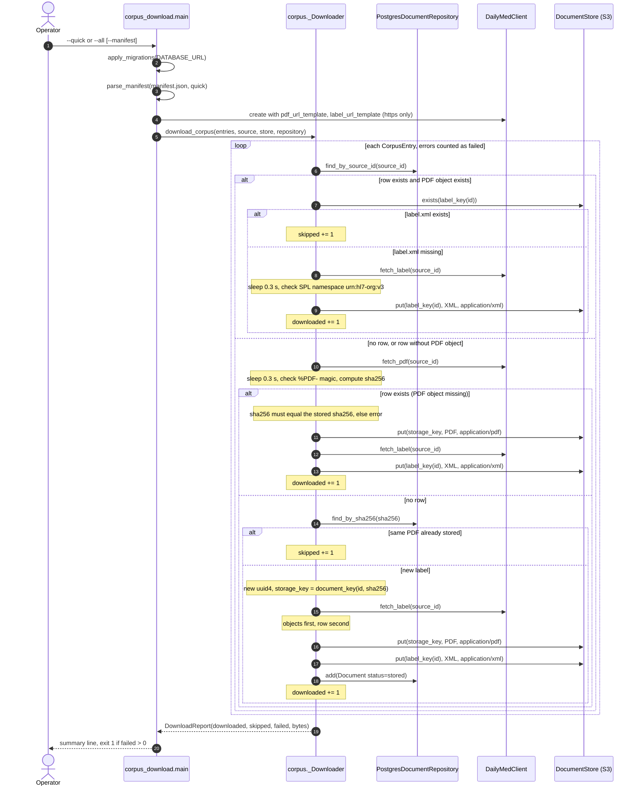

# Corpus download

`python -m app.corpus_download --quick|--all` stores the label PDF and the SPL XML of each manifest entry, then adds the document row. The run is idempotent by `source_id`.

```mermaid
sequenceDiagram
    autonumber
    actor Op as Operator
    participant CLI as corpus_download.main
    participant DL as corpus._Downloader
    participant Repo as PostgresDocumentRepository
    participant Src as DailyMedClient
    participant Store as DocumentStore (S3)

    Op->>CLI: --quick or --all [--manifest]
    CLI->>CLI: apply_migrations(DATABASE_URL)
    CLI->>CLI: parse_manifest(manifest.json, quick)
    CLI->>Src: create with pdf_url_template, label_url_template (https only)
    CLI->>DL: download_corpus(entries, source, store, repository)

    loop each CorpusEntry, errors counted as failed
        DL->>Repo: find_by_source_id(source_id)
        alt row exists and PDF object exists
            DL->>Store: exists(label_key(id))
            alt label.xml exists
                Note over DL: skipped += 1
            else label.xml missing
                DL->>Src: fetch_label(source_id)
                Note over DL: sleep 0.3 s, check SPL namespace urn:hl7-org:v3
                DL->>Store: put(label_key(id), XML, application/xml)
                Note over DL: downloaded += 1
            end
        else no row, or row without PDF object
            DL->>Src: fetch_pdf(source_id)
            Note over DL: sleep 0.3 s, check %PDF- magic, compute sha256
            alt row exists (PDF object missing)
                Note over DL: sha256 must equal the stored sha256, else error
                DL->>Store: put(storage_key, PDF, application/pdf)
                DL->>Src: fetch_label(source_id)
                DL->>Store: put(label_key(id), XML, application/xml)
                Note over DL: downloaded += 1
            else no row
                DL->>Repo: find_by_sha256(sha256)
                alt same PDF already stored
                    Note over DL: skipped += 1
                else new label
                    Note over DL: new uuid4, storage_key = document_key(id, sha256)
                    DL->>Src: fetch_label(source_id)
                    Note over DL: objects first, row second
                    DL->>Store: put(storage_key, PDF, application/pdf)
                    DL->>Store: put(label_key(id), XML, application/xml)
                    DL->>Repo: add(Document status=stored)
                    Note over DL: downloaded += 1
                end
            end
        end
    end

    DL-->>CLI: DownloadReport(downloaded, skipped, failed, bytes)
    CLI-->>Op: summary line, exit 1 if failed > 0
```
